Minswap Lending Market – Long/Short: Milestone 1 Submission (Preview Testnet)
================================================================================

This document provides a reviewer-oriented package for Milestone 1: Off-chain integration enabling Long positions via lending + DEX, including clearly mapped acceptance criteria, evidence artifacts, and how a reviewer can verify end-to-end without local setup.

## What was delivered in Milestone 1

- Off-chain integration that orchestrates a Long position flow across a lending protocol and Minswap DEX on Cardano Preview testnet.
- Multi-step transaction flow executed seamlessly via a passwordless Nitro Wallet, reducing user signing friction while preserving non-custodial control on-device.
- Example end-to-end run with verifiable on-chain transactions and UI walkthrough screenshots.

Scope and constraints
- Network: Cardano Preview testnet for POC demonstration.
- Protocol: Integrated against a Cardano lending protocol supported by the flow (Preview testnet).
- UI: Demo web app and screenshots included for reviewer verification.

## Acceptance criteria mapping (Milestone 1)

AC1. Off-chain integration enables supply → borrow → purchase for Long positions.
- Evidence: Steps 5–8 transactions and screenshots (links below) show buying the long asset, supplying collateral, borrowing, and buying more of the long asset with borrowed funds.

AC2. Seamless integration between DEX and lending protocol.
- Evidence: A single user-initiated flow that spans Minswap swaps and lending protocol calls, coordinated by the off-chain integration and executed by Nitro Wallet without repeated password prompts. Screenshots depict uninterrupted UI experience across steps.

AC3. Transactions optimized for efficiency and minimized fees.
- Evidence: The flow minimizes round-trips by batching logically adjacent actions per step and automating signatures via Nitro Wallet to reduce user interaction cost. Reviewers can assess fee totals per transaction via the linked explorers.

## Evidence artifacts

Repository (open source)
- https://github.com/minswap/felis (this repository)

Demo (Preview testnet)
- http://dev-3.tail2feb3.ts.net:3000
  - If unreachable due to network policies, use the step-by-step screenshots below.

Step-by-step transaction links (Preview testnet)
1) Buying asset (enter position):
  https://preview.cexplorer.io/tx/4a7e55abccad420a07fdd9bfda9346f471cfd629aa21a60e39dd0301fc3b319a?tab=content
2) Supplying collateral:
  https://preview.cexplorer.io/tx/4870d7b47df0aa1194a6bcb0a05ec7a17bc4fd2869d4b9c203551689cc2f5d46?tab=content
3) Borrowing asset:
  https://preview.cexplorer.io/tx/506761d223bf8087e2c7357a15ef305655903982b425a7e68e39cb04312fcc86?tab=content
4) Buying more of the long asset (with borrowed funds):
  https://preview.cexplorer.io/tx/72ae270405f6cfac55663268ebf421a4665c31f112d10b761a4d04675eac6172?tab=content

Screenshots (in repo)
- images/connect-eternl-wallet.png
- images/create-nitro-wallet.png
- images/deposit-fund.png
- images/open-long-position.png
- images/step1-buying-asset.png
- images/step2-supply-token.png
- images/step3-borrow-ada.png
- images/step-4-buy-more-long-asset.png
- images/step-10-close-position.png
- images/step-11-selling-token.png
- images/step-12-repay.png
- images/step-13-withdraw-supply.png
- images/step-14-sell-all-long-asset.png

## How reviewers can verify the milestone

Quick review
1) Open each transaction link above and confirm:
  - Inputs/outputs align with the described step (swap, supply, borrow, swap).
  - Fees are present and reasonable for Preview testnet.
  - Assets and policy IDs are consistent across steps (the supplied and borrowed assets match the flow intent).
2) Cross-check screenshots in the repo’s images/ directory for the same step numbers and UI states.

Optional local verification (developer review)
- Code: Off-chain orchestration logic and transaction building live in this monorepo. Relevant packages include:
  - apps/web — Demo Next.js app for the UI flow.
  - packages/tx-builder — High-level transaction composition utilities.
  - packages/ledger-core, packages/ledger-utils — Ledger primitives and utilities used by the builder.
  - packages/minswap-lending-market — Integration-specific code for lending + DEX flows.
- Reviewers can inspect these packages to see how supply/borrow/swap legs are constructed and signed via Nitro Wallet.

## Nitro Wallet (passwordless) summary

- Non-custodial: private key persists on the user’s device; no backend custody.
- Auto-sign within user-granted scope: enables multi-step flows (e.g., long/short) without repeated password prompts.
- Privacy: No on-chain linkage to the user’s primary wallet account beyond what’s inherent to transactions.
- Purpose in Milestone 1: reduce friction for chained steps across DEX and lending protocol while preserving control.

## KPIs and measurement plan (for acceptance and ongoing QA)

- Functional success rate: Percentage of flows that complete 4-step open (buy → supply → borrow → buy-more) without manual recovery.
- Latency per step: Time from submit to confirmation on Preview testnet.
- Average fee per step and total fee for the open flow.
- Off-chain code coverage (unit + integration) for critical builders and encoders/decoders.
- User interaction count: number of confirmations/sign prompts (target minimized via Nitro Wallet).

Note: For Milestone 1 we define the KPIs and provide verifiable transactions; deeper benchmarking will be expanded as the codebase stabilizes toward mainnet readiness.

## Risks and mitigations

- Protocol parameter drift or breaking changes: abstract interaction behind integration layer; keep contract hashes/configs versioned per network.
- Liquidity and price movement on testnet: choose sufficiently liquid pairs or throttle size for stable demos; retries on slippage.
- WASM/CSL initialization issues: load Rust module once at app start; robust error reporting (see ledger-core patterns).
- Wallet interoperability: provide fallback to standard signing if Nitro Wallet isn’t available; keep Nitro strictly opt-in.

## Next milestone (Short positions – preview)

- Extend the same orchestration to short flows: supply base asset → borrow target asset → sell on DEX → later buy back → repay → withdraw.
- Add health metrics (LTV, liquidation buffers), more educational UI, and guardrails.

### Milestone 1: Integration for Long Positions
Milestone Outputs: Off-chain integration enabling long position operations through Minswap and the chosen lending protocol on Cardano (either Liqwid or Lenfi).
Acceptance criteria:
  Off-chain integration successfully enables asset supply, borrowing, and purchasing for long positions.
  Seamless integration between both Minswap and the lending protocol.
  Transactions are optimized for efficiency and minimized fees.
Evidence of milestone completion:
An open-source code repository: https://github.com/minswap/felis
Documentation explaining how the Long integration works, including the transaction flows, code examples for longing a token using the SDK, and transaction links for each step.

### Demo POC version for Milestone 1:
- Testnet Preview Link: http://dev-3.tail2feb3.ts.net:3000

### Document explaining how the Long integration works:
1. User connect wallet
2. User create Nitro Wallet
  Nitro Wallet is passwordless trading wallet.
  Main feature:
    + No more signing for every tx
    + Instant 1-Click Trades
    + Non-custodial: Private key is stored on user's device
    + Privacy: No link between current wallet and nitro wallet, it appears like a normal wallet
    + Password-less: User can make txs without inputting password
    + Auto-sign multiple txs: Wallet can auto-sign new txs from backend on user's behalf, enabling users to do multiple-steps tx like long/short with Liqwid
    + No Backend, never send any data to server
3. User Deposit fund to Nitro Wallet to start trading Long/Short
4. Setup your trading (example: LONG $MIN token with margin 1.5x)
5. Place Long Position.
6. Nitro Wallet auto handle opening Long position.
7. User can close Long Position and capture their profit.

### Example Work
1. Connect to Eternl Wallet
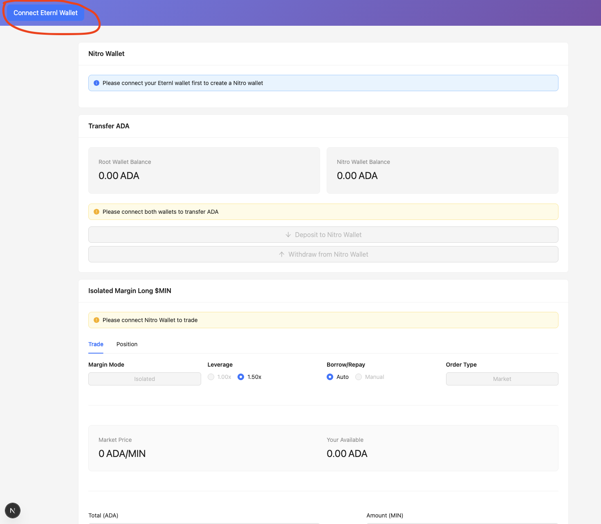
2. Create Nitro Wallet
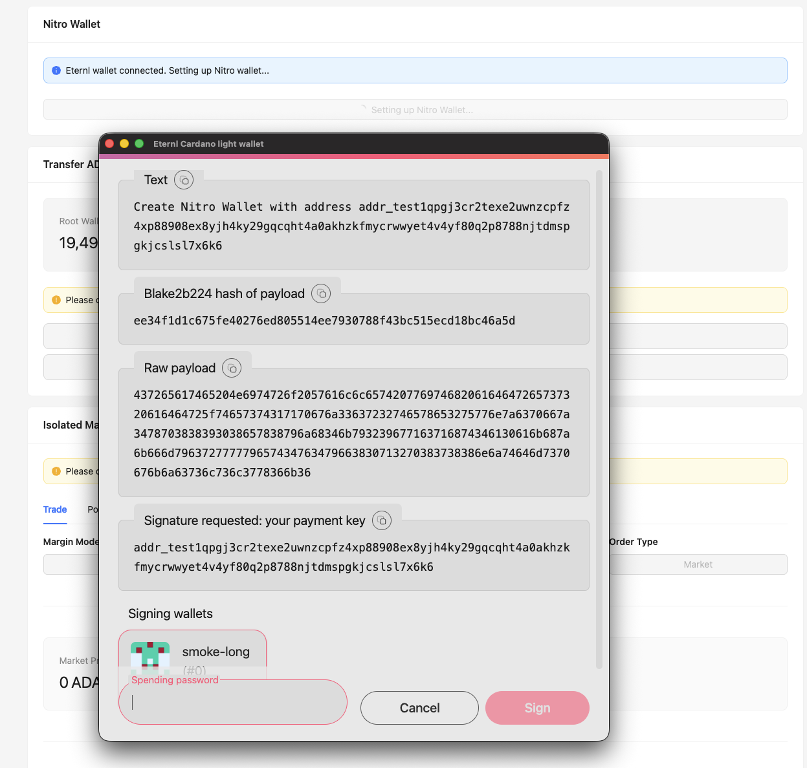
3. Deposit ADA to Nitro Wallet
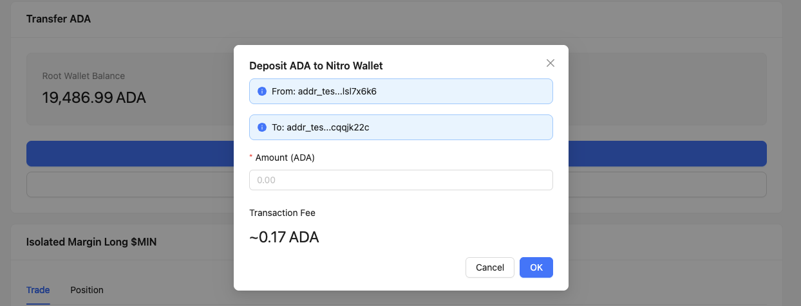
4. Open Long Position
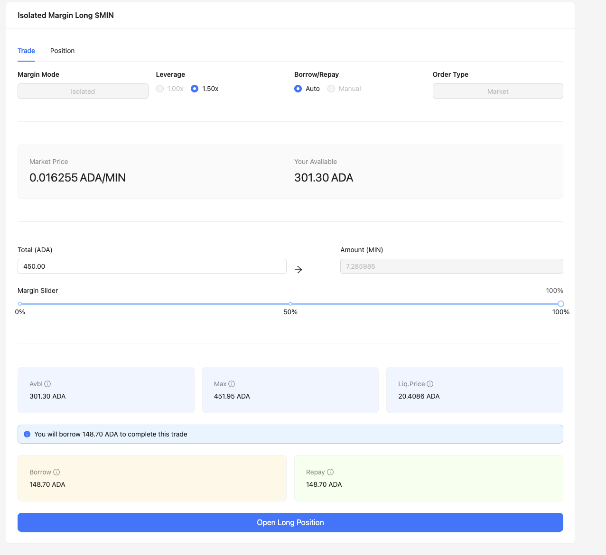
5. Buying Asset
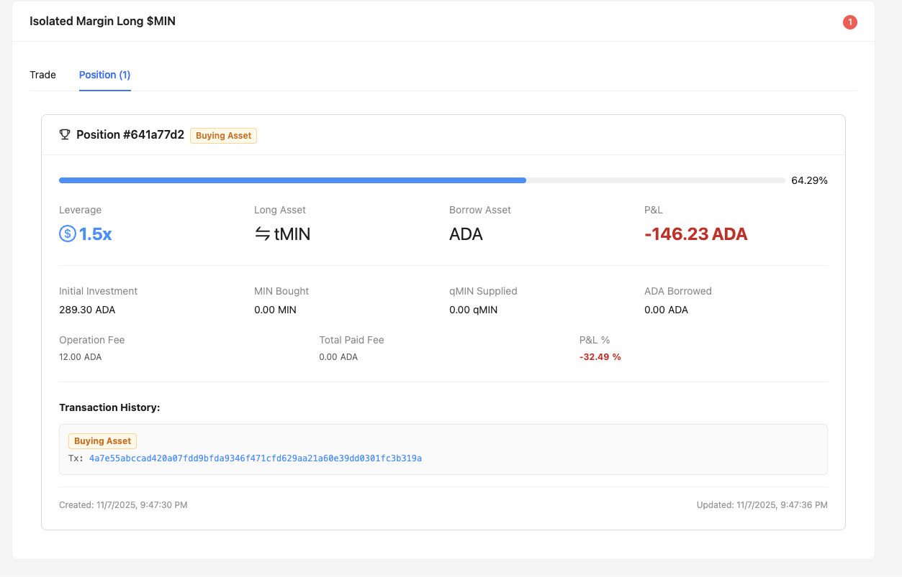
Tx: https://preview.cexplorer.io/tx/4a7e55abccad420a07fdd9bfda9346f471cfd629aa21a60e39dd0301fc3b319a?tab=content
6. Supplying Token

Tx: https://preview.cexplorer.io/tx/4870d7b47df0aa1194a6bcb0a05ec7a17bc4fd2869d4b9c203551689cc2f5d46?tab=content
7. Borrow Token
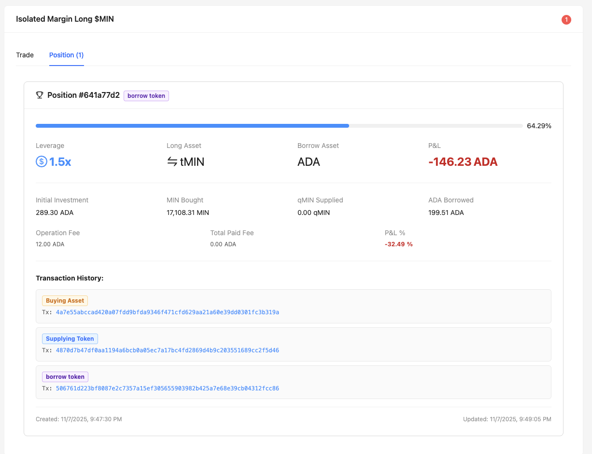
Tx: https://preview.cexplorer.io/tx/506761d223bf8087e2c7357a15ef305655903982b425a7e68e39cb04312fcc86?tab=content
8. Buy More Long Asset
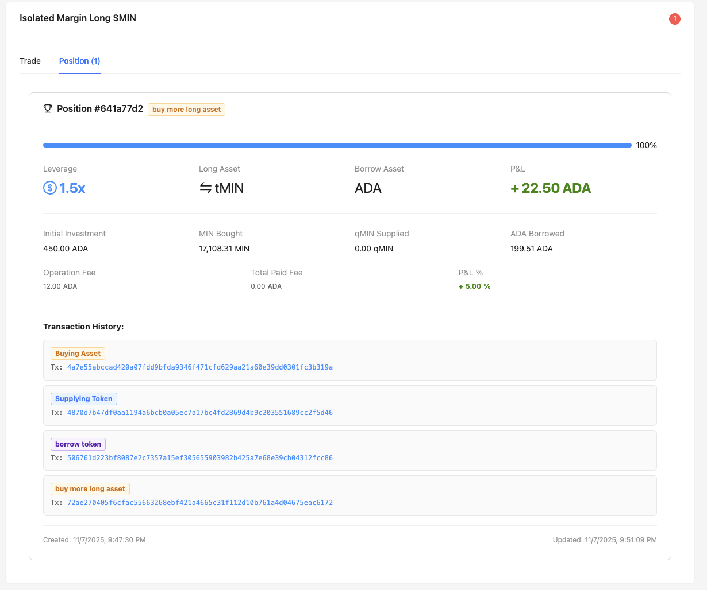
Tx: https://preview.cexplorer.io/tx/72ae270405f6cfac55663268ebf421a4665c31f112d10b761a4d04675eac6172?tab=content
9. Long Position is opening
10. Phrase 2: Close Position
User Click Button Close Position
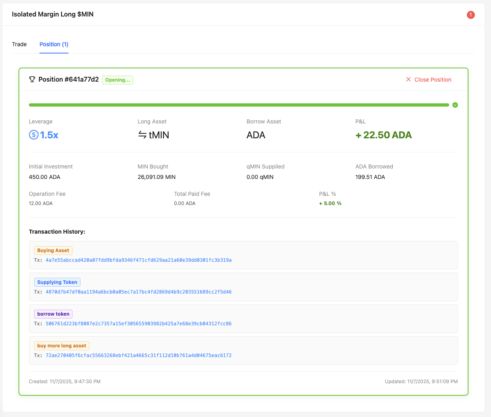
11. Selling Token
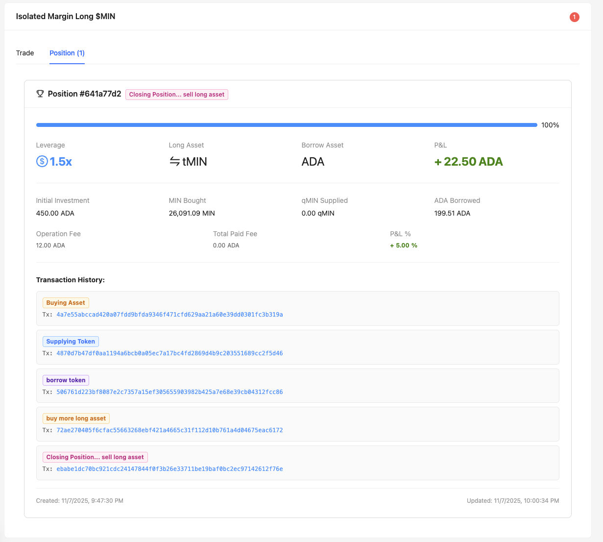
Tx: https://preview.cexplorer.io/tx/ebabe1dc70bc921cdc24147844f0f3b26e33711be19baf0bc2ec97142612f76e?tab=content
12. Repay Loan
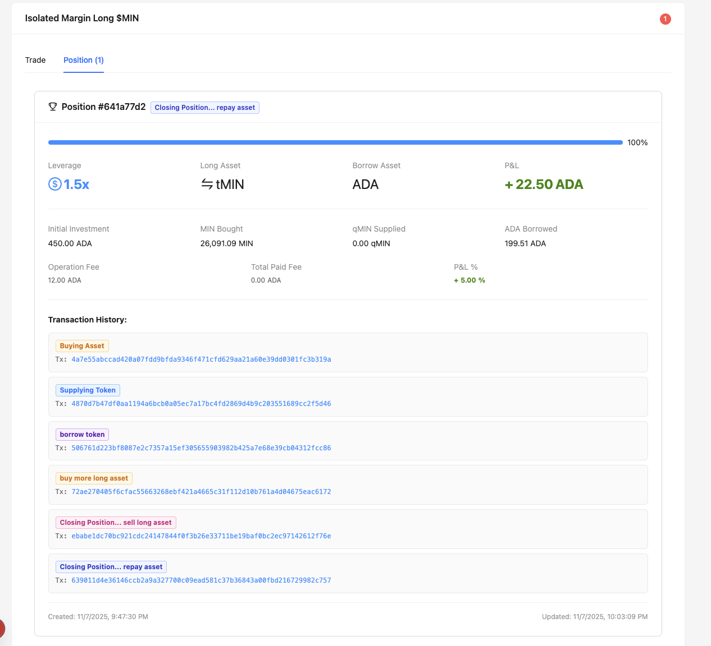
Tx: https://preview.cexplorer.io/tx/639011d4e36146ccb2a9a327700c09ead581c37b36843a00fbd216729982c757?tab=content
13. Withdraw Collateral
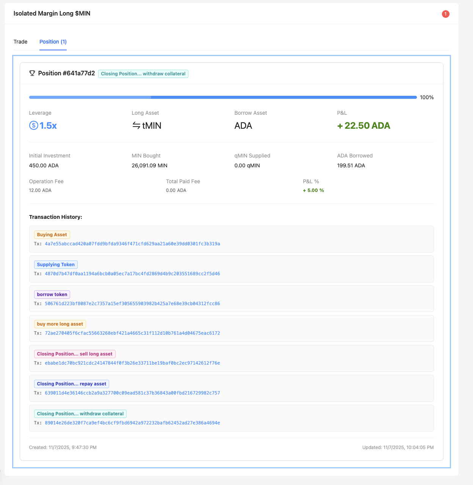
Tx: https://preview.cexplorer.io/tx/89014e26de320f7ca9ef4bc6cf9fbd6942a972232bafb62452ad27e386a4694e?tab=content
14. Sell All Long Asset
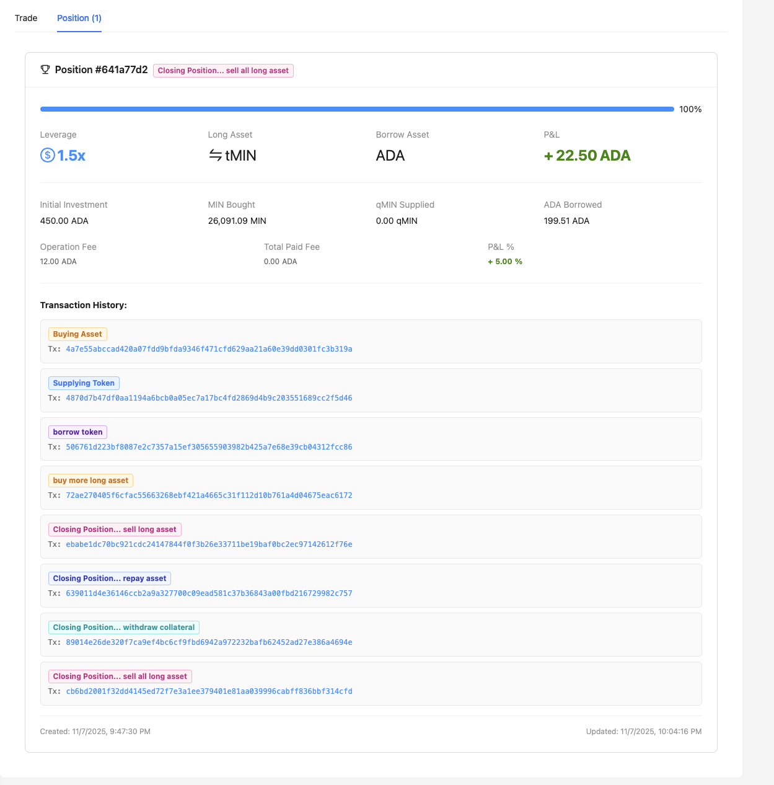
Tx: https://preview.cexplorer.io/tx/cb6bd2001f32dd4145ed72f7e3a1ee379401e81aa039996cabff836bbf314cfd?tab=content
Done.
