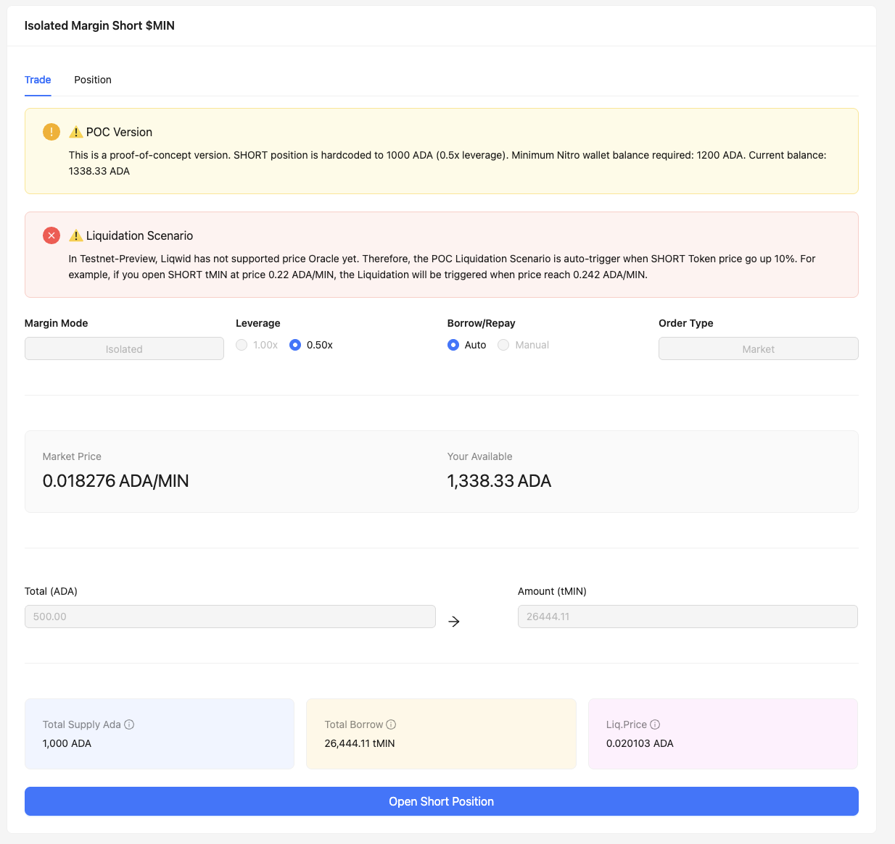
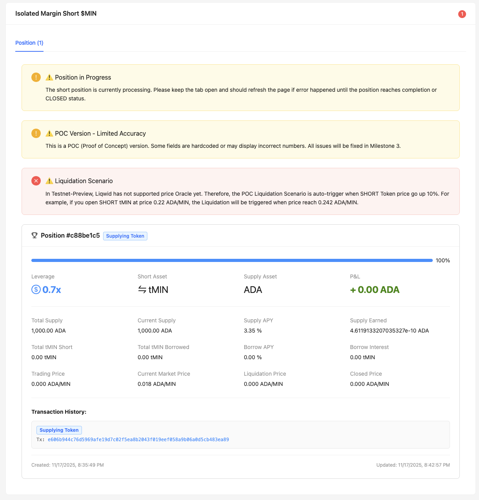
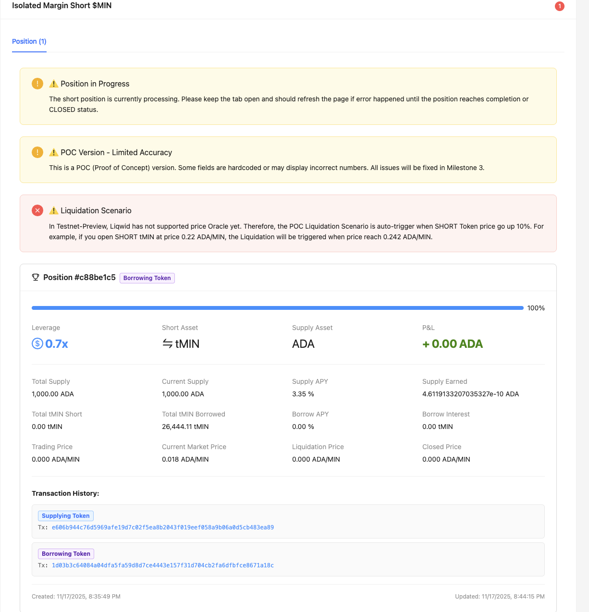
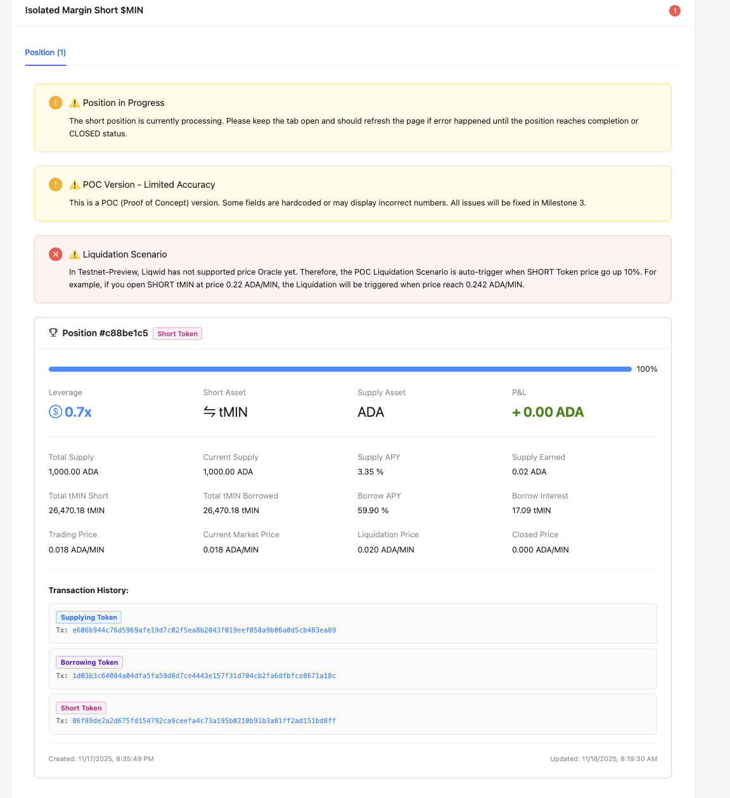
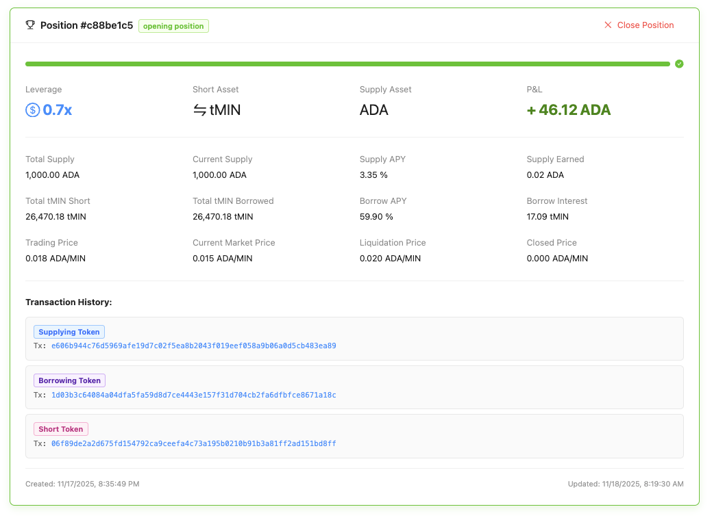
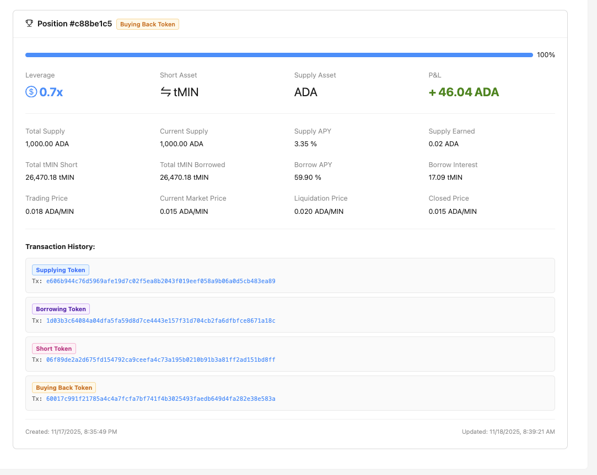
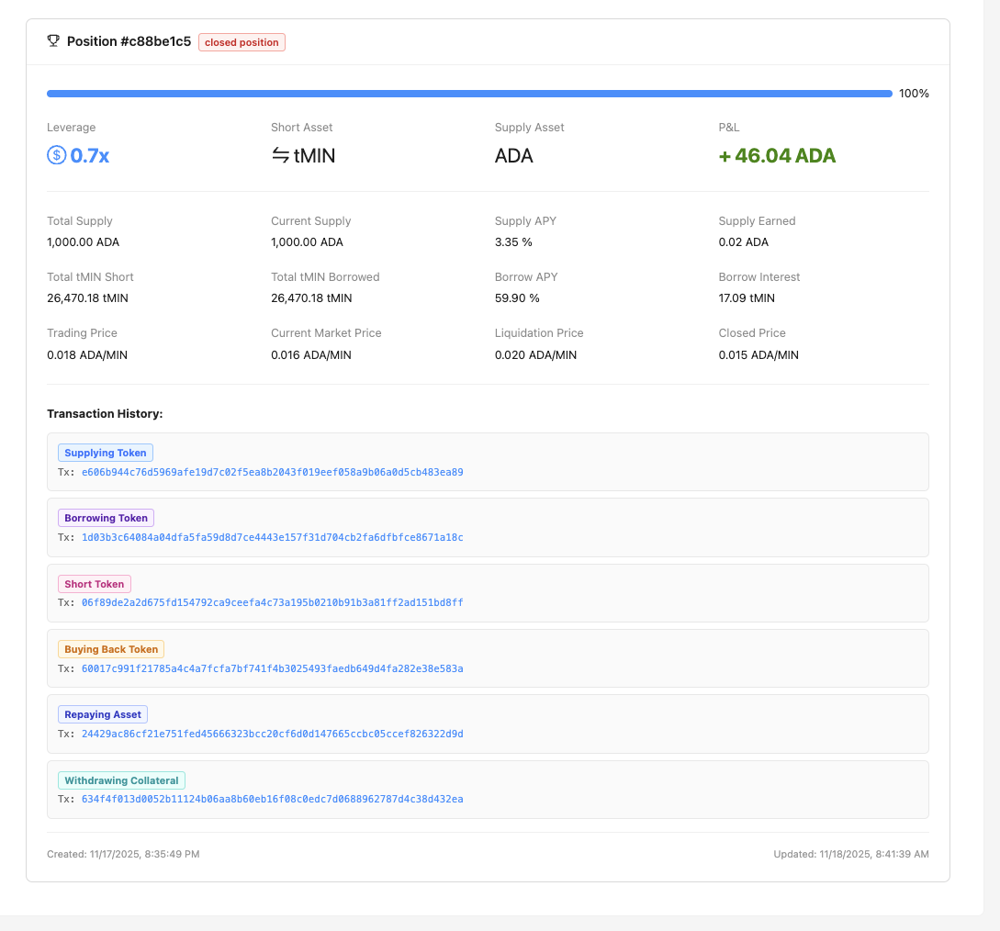
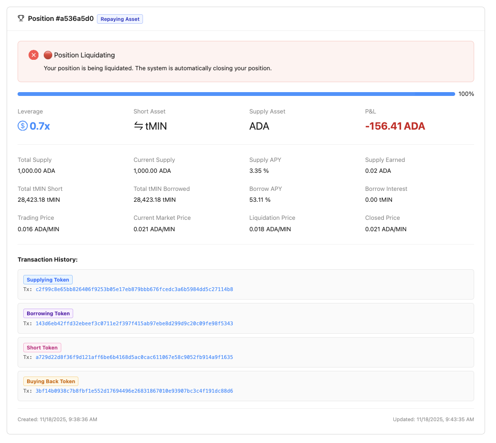

# Minswap Lending Market – Long/Short: Milestone 1, 2 Submission (Testnet Preview)
This document provides a reviewer-oriented package for Milestone 1,2 : Off-chain integration enabling Long/Short positions via Minswap + Liqwid, including clearly mapped acceptance criteria, evidence artifacts, and how a reviewer can verify end-to-end without local setup.

## Evidence artifacts
Repository (open source)
- https://github.com/minswap/felis

Minswap Interface (Trading tMIN - ADA Page)
- https://interface-git-tony-adhoc-interface-minswap.vercel.app/swap?cA=919d4c2c9455016289341b1a14dedf697687af31751170d56a31466e&tA=744d494e&cB=&tB=

Liqwid Interface
- https://dev.liqwid.finance/

Demo Interface
- https://dev-3.minswap.org

## "A tour" of what I accomplished in Milestone 1
### Milestone Outputs
#### _Off-chain integration enabling long position operations through Minswap and the chosen lending protocol on Cardano (either Liqwid or Lenfi)._
- <b>User can open-close long position (Isolated Margin Long $MIN) through Minswap Dex V2 + Liqwid V2 via a simple POC Interface.</b>
- Multi-steps Transactions flow were executed seamlessly via password-less Nitro Wallet, reducing user signing many transactions while preserving non-custodial control on-device, also save user time to wait many transactions confirmed and adhoc tasks on interface.
- Minswap x Liqwid Integration SDK is fully functional.

### Acceptance criteria
#### _Off-chain integration successfully enables asset supply, borrowing, and purchasing for long positions._
- The off-chain integration between Minswap V2 and Liqwid V2 has been completed and is fully functional, allowing users to open leveraged long positions in isolated margin mode – exactly the same experience as margin trading on centralized exchanges (CEX).

#### _Seamless integration between both Minswap and the lending protocol._
- With Nitro Wallet, User doesn't need to sign any transaction to open-close Position.
- With Liqwid Integration SDK, User doesn't need go to Liqwid Page then supply-borrow-repay-withdraw.
- User doesn't care about any states, just focus on trading.
- For example if User (Alice) do it by herself:
  0. Alice need to learn about how Liqwid work and how to leverage trading by borrowing tokens.
  1. Alice create BUY order ADA -> MIN on Minswap.
  2. Alice keep waiting and refresh page until Order was batched.
  3. Alice go to Liqwid page and try to supply her $MIN tokens.
  4. Alice keep waiting and refresh page util she received $qMIN tokens.
  5. Alice deposit $qMIN as collaterals and borrow some $ADA tokens (self calculated how many ADA need to be borrowed)
  6. Alice keep waiting and refresh page until her borrow position has approved and she received borrowed ADA.
  7. Alice take $ADA to BUY more $MIN on Minswap.
  ...... a few moments later
  8. Alice want to close position, then she start sell all her $MIN
  9. Alice keep waiting and refresh page util Order was batched.
  10. Alice take $ADA and go to Liqwid Page to repay her loan.
  11. Alice keep waiting and refresh page util her loan fully repaid and closed.
  12. Alice take $qMIN and go to Liqwid Page to withdraw and get back her $MIN.
  13. Alice keep waiting and refresh page util she received $MIN tokens back.
  14. Alice go to Minswap Page, create SELL order to sell her $MIN and capture her profit.
  15. Alice keep waiting and refresh page util Order was batched.

  -> _Lesson for Alice: Open Minswap Lending Market, go try it yourself, open a 1.5x $MIN long with 400 ADA and tell me it’s not seamless. I dare you 😎_

#### _Transactions are optimized for efficiency and minimized fees._
- Partially achieved in current milestone, with full optimization scheduled for the next milestone after Liqwid releases the required APIs.
- Explanation & Evidence:
- The Liqwid V2 smart contracts currently have the following technical limitations that directly prevent full optimization at the smart-contract interaction layer:
  - Building Transactions in Liqwid is centralize (required Liqwid's Admin Signed) and only support via Liqwid APIs.
  - Supplying assets on Liqwid only supports PubKey addresses, not Script addresses (Native or Plutus).
  - → This forces the frontend/dApp connector (in this case Minswap) to manually construct the supply transaction instead of using Liqwid's high-level SDK, which significantly increases complexity and prevents batching/optimization at the protocol level.
  - While Borrow, Repay, and Liquidation operations technically allow script-to-script interaction, Liqwid's current BuildTx API does not expose the necessary endpoints to build these transactions when the user address is a script (Minswap Order Script Address).
  → As a result, I cannot yet batch multiple actions (e.g., open leveraged position → supply collateral → borrow → execute swap on Minswap in a single transaction) in the most efficient way possible.
- I have been continuous contact with the Liqwid team. They have confirmed that they've been updating their APIs in order to support script-to-script interaction.
- Once their API is live, I will immediately:
  - Refactor code to educe the number of required transactions.
  → As a result, It will minimize time processing and achieve the lowest possible fees for users
- Minswap Order on Lending Market will apply Minswap Instant Batching Mode (will implement at Milestone 3).

## POC Version Limitations (Milestone 1)
- This Milestone 1 POC is built purely to prove the core concept works end-to-end and to deliver the "How Long Position work?". It is not Ready-Production for users.
- What it does NOT include yet (all planned for Milestone 3 – Frontend Interface):
  - Polished production UI/UX (current interface is minimal & intentional)
  - Some numbers/values are hard-coded or placeholder (will be fixed with final design)
  - Liquidation Flow (waiting for Liqwid to ship on-chain price oracles on Testnet Preview)
  - Advanced use-cases, edge cases, and full error handling
  - Liqwid currently does not support Oracle to update Token Price on https://dev.liqwid.finance => I omit Liquidation flow on Milestone 1, waiting Liqwid team to  support and support it at Milestone 3.

- _Milestone 1 = "It works, it's live, real users are already trading with leverage."_
- _Milestone 3 = "Pixel-perfect, bulletproof, ready for millions."Everything else will be shipped in the next phase. Thanks for understanding!_

## "A tour" of what I accomplished in Milestone 2
### Milestone Outputs
#### _Off-chain integration enabling short position operations through Minswap and the chosen lending protocol integration on Cardano (if Liqwid is not possible, we use LenFi)._
- <b>User can open-close short position (Isolated Margin Short $MIN) through Minswap Dex V2 + Liqwid V2 via a simple POC Interface.</b>
- Multi-steps Transactions flow were executed seamlessly via password-less Nitro Wallet, reducing user signing many transactions while preserving non-custodial control on-device, also save user time to wait many transactions confirmed and adhoc tasks on interface.
- Minswap x Liqwid Integration SDK is fully functional.
- The POC includes `interest calculations` and `liquidation scenarios`.

### Acceptance criteria
#### _Off-chain integration successfully facilitate asset supply, borrowing, selling, and repurchasing for short positions._
- With ADA only, user can short $tMIN with leverage margin 0.5x. For example, Alice has 1000 ADA, she can short 20k %tMIN (~= 500 ADA) and expecting $tMIN price go down and capture her profit.

### _Integration handles the complexities of short positions, including interest calculations and liquidation scenarios._
- <b>Interest Calculations</b>:
  - Add some new functions for Liqwid Provider SDK to query `Supply, Borrow Interest Data` (e.g. Supply APY, Borrow APY, Supply Interest, Borrow Interest, ...)
  - Support calculate Estimate PnL
- <b>Liquidation Scenarios</b>:
  - _In Testnet-Preview, Liqwid has not supported price Oracle yet. Therefore, the POC Liquidation Scenario is auto-trigger when SHORT Token price go up 10%. For example, if you open SHORT tMIN at price 0.22 ADA/MIN, the Liquidation will be triggered when price reach 0.242 ADA/MIN._
  - To test the liquidation scenario, I manipulated the ADA-MIN price to increase by 10% or more, successfully triggering the liquidation process. This simulation helps verify that the protection mechanism works correctly and prevents real liquidations for users on Liqwid Platform.

### _Integration with both Minswap and the possible lending protocol is seamless and efficient._
- Work similar to Milestone 1.

## Nitro Wallet (password-less) summary

- Non-custodial: private key persists on the user’s device.
- Security: Never send any data to Backend.
- seamless: Auto-sign within user-granted scope: enables multi-step flows (e.g., long/short) without repeated password prompts.
- Privacy: No on-chain linkage to the user’s primary wallet account beyond what’s inherent to transactions.

## Technical Details
- [Nitro Wallet](/packages/minswap-lending-market/src/nitro-wallet.ts)
- [Liqwid SDK](/packages/minswap-lending-market/src/lending-market.ts)
- [Minswap SDK](/packages/minswap-build-tx/)
- [Minswap Transaction Builder SDK](/packages/tx-builder/)

## Document explaining how the Long integration works:
1. User connect wallet
2. User create Nitro Wallet
3. User Deposit fund to Nitro Wallet to start trading Long/Short
4. Setup your trading (example: LONG $MIN token with total buy in 300 ADA and leverage margin is 1.5x)
5. Place Long Position.
6. Nitro Wallet auto handle opening Long position.
7. User can close Long Position and capture their profit.

## Document explaining how the Short integration works:
1. User connect wallet
2. User create Nitro Wallet
3. User Deposit fund to Nitro Wallet to start trading Long/Short
4. Setup your trading (example: SHORT $MIN token with total supply 1000 ADA and leverage margin is 0.5x)
5. Place Short Position.
6. Nitro Wallet auto handle opening Short position.
7. User can close Short Position and capture their profit.

## Example Work Isolated Margin Long ADA-MIN
#### 0. Clear History & Reset
- When you want to clear all Position and test again, please click on `Clear History & Reset` Button.
#### 1. Connect to Eternl Wallet
- 

#### 2. Create Nitro Wallet
- 

#### 3. Deposit ADA to Nitro Wallet
- 

#### 4. Open Long Position
- 

#### 5. Buying Asset [TxReference](https://preview.cexplorer.io/tx/4a7e55abccad420a07fdd9bfda9346f471cfd629aa21a60e39dd0301fc3b319a?tab=content)
- 

#### 6. Supplying Token [TxReference](https://preview.cexplorer.io/tx/4870d7b47df0aa1194a6bcb0a05ec7a17bc4fd2869d4b9c203551689cc2f5d46?tab=content)
- 

#### 7. Borrow Token [TxReference](https://preview.cexplorer.io/tx/506761d223bf8087e2c7357a15ef305655903982b425a7e68e39cb04312fcc86?tab=content)
- 

#### 8. Buy More Long Asset [TxReference](https://preview.cexplorer.io/tx/72ae270405f6cfac55663268ebf421a4665c31f112d10b761a4d04675eac6172?tab=content)
- 

#### 9. Long Position is opening

#### 10. Phrase 2: Close Position
- User Click Button Close Position

- 

#### 11. Selling Token [TxReference](https://preview.cexplorer.io/tx/ebabe1dc70bc921cdc24147844f0f3b26e33711be19baf0bc2ec97142612f76e?tab=content)
- 

#### 12. Repay Loan [TxReference](https://preview.cexplorer.io/tx/639011d4e36146ccb2a9a327700c09ead581c37b36843a00fbd216729982c757?tab=content)
- 

#### 13. Withdraw Collateral [TxReference](https://preview.cexplorer.io/tx/89014e26de320f7ca9ef4bc6cf9fbd6942a972232bafb62452ad27e386a4694e?tab=content)
- 

#### 14. Sell All Long Asset [TxReference](https://preview.cexplorer.io/tx/cb6bd2001f32dd4145ed72f7e3a1ee379401e81aa039996cabff836bbf314cfd?tab=content)
- 

## Example Work Isolated Margin Short ADA-MIN
### Basic Short Flow
#### 0. Clear History & Reset
- When you want to clear all Position and test again, please click on `Clear History & Reset` Button.
#### 1. Connect to Eternl Wallet
- 

#### 2. Create Nitro Wallet
- 

#### 3. Deposit ADA to Nitro Wallet
- 

#### 4. Open Short Position
- 

#### 5. Supplying ADA [TxReference](https://preview.cexplorer.io/tx/e606b944c76d5969afe19d7c02f5ea8b2043f019eef058a9b06a0d5cb483ea89?tab=content)
- 

#### 6. Borrowing $tMIN [TxReference](https://preview.cexplorer.io/tx/1d03b3c64084a04dfa5fa59d8d7ce4443e157f31d704cb2fa6dfbfce8671a18c?tab=content)
- 

#### 7. Short $tMIN [TxReference](https://preview.cexplorer.io/tx/06f89de2a2d675fd154792ca9ceefa4c73a195b0210b91b3a81ff2ad151bd8ff?tab=content)
- 

#### 8. Short Position is opening

#### 10. Phrase 2: Close Position
- User Click Button Close Position

- 

#### 11. Buy Back Token [TxReference](https://preview.cexplorer.io/tx/ebabe1dc70bc921cdc24147844f0f3b26e33711be19baf0bc2ec97142612f76e?tab=content)
- 

#### 12. Repay Loan [TxReference](https://preview.cexplorer.io/tx/24429ac86cf21e751fed45666323bcc20cf6d0d147665ccbc05ccef826322d9d?tab=content)
- 

#### 13. Withdraw Collateral [TxReference](https://preview.cexplorer.io/tx/634f4f013d0052b11124b06aa8b60eb16f08c0edc7d0688962787d4c38d432ea?tab=content)
- 

### Short Liquidation Flow
- In Testnet-Preview, Liqwid has not supported price Oracle yet. Therefore, the POC Liquidation Scenario is auto-trigger when SHORT Token price go up 10%. For example, if you open SHORT tMIN at price 0.22 ADA/MIN, the Liquidation will be triggered when price reach 0.242 ADA/MIN.
- So for testing, after `position is opening`, I manipulate `ADA-MIN` price go up that trigger Liquidation Process:
- 
